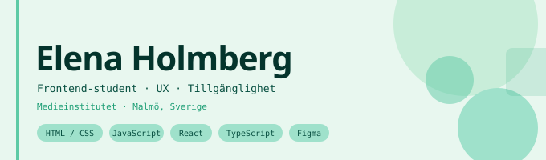

📍 Malmö, SE  

---

## Söker LIA-plats till januari 2027

Jag är en positiv och energisk person som trivs lika bra med att jobba självständigt som i team. 
Som egenföretagare har jag blivit en problemlösare av rang och ger mig inte förrän jag hittat ett sätt framåt. En egenskap jag haft stor fördel av som utvecklare. 
Mina många år i arbetslivet har gett mig kunskap och mod att ta egna initiativ och att hugga in där det behövs.

På en LIA-plats får ni någon som kommer in med glädje, energi, engagemang och en genuin vilja att bidra — från dag ett.

## Om mig

Jag studerar **Frontend-utveckling** på Medieinstitutet med en bakgrund inom **e-handel** , entreprenörskap och visual merchandising — erfarenheter som gett mig ett genuint öga för användarupplevelse, visuell kommunikation och vad som faktiskt får en produkt att fungera.

Jag tar med mig ett skarpt öga för flöde, estetik och vad som faktiskt funkar för användaren — in i varje komponent jag bygger, och jag vill skapa snygga och enkla användargränssnitt som även min 109-åriga mormor kan förstå sig på.

Jag använder AI som ett pedagogiskt verktyg i mina studier — för att fördjupa förståelse, utforska koncept och få snabbare feedback. Jag skriver koden själv; målet är att förstå varje rad på djupet, inte att få den serverad. Just nu brinner jag lite extra för **tillgänglighet och refaktorering.**

---

## Tekniker & verktyg

---

## Vad jag fokuserar på

**🎨 UI & visuell design** — Skapar gränssnitt som är estetiskt genomtänkta och intuitiva att använda.

**♿ Tillgänglighet** — Bygger för alla — WCAG, semantisk HTML och inkluderande design som standard.

**👥 UX-tänk** — Alltid med användarens perspektiv i åtanke — från wireframe till färdig komponent.

**⚙️ Frontend & backend** — Förstår flödet hela vägen — HTML/CSS/React, TypeScript, Node.js samt API.

**✨ AI i arbetsflödet** — Använder AI som sparringpartner — effektivare, men aldrig på bekostnad av att faktiskt förstå koden.

---

## Kontakt

- 💼 [LinkedIn](linkedin.com/in/elena-holmberg-b4a749aa) 
- 📧 elenaholmberg83@hotmail.com
- 🌐 [Portfolio]

---

*Studerar på Medieinstitutet — alltid nyfiken, alltid på väg att lära mig något nytt.*
